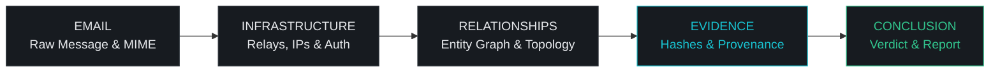
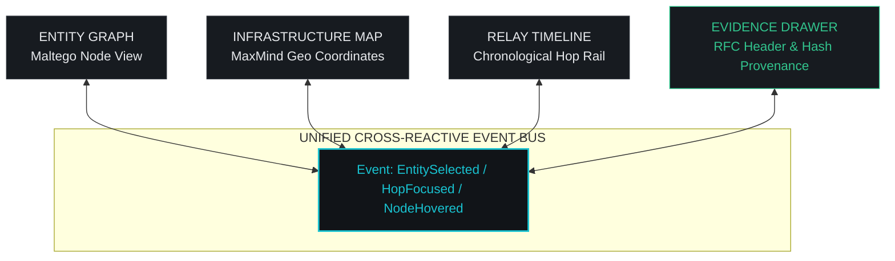

# SIH26106 Forensic Intelligence Platform
## UI/UX Architecture & Design System Specification (MVP)

---

## 1. Executive Rationale & Investigative Information Architecture

Forensic email threat investigation is an adversarial, high-stakes discipline. Security analysts do not need neon-glow dashboards or marketing metrics; they require **unimpeachable provenance, high data density without clutter, rapid cross-correlation, and zero ambiguity between raw observed facts and analytical conclusions**.

### 1.1 The Forensic Investigation Pipeline
The user interface is modeled directly on the forensic workflow:

```text
┌─────────────────┐       ┌─────────────────┐       ┌─────────────────┐
│ 1. EMAIL INGEST │ ───>  │ 2. RECONSTRUCT  │ ───>  │ 3. CORRELATE    │
│ Raw RFC 5322    │       │ Headers, Relays │       │ IPs, Domains,   │
│ & Attachments   │       │ & Auth (SPF/DKIM│       │ Geolocation, ASN│
└─────────────────┘       └─────────────────┘       └─────────────────┘
                                                             │
┌─────────────────┐       ┌─────────────────┐                │
│ 5. CONCLUSION   │ <───  │ 4. EVIDENCE &   │ <──────────────┘
│ Forensic Report │       │ ASSESS          │
│ & Remediations  │       │ Dual Risk/Conf. │
└─────────────────┘       │ & Maltego Graph │
                          └─────────────────┘
```



### 1.2 The Epistemic Provenance Model
Every artifact, indicator, and conclusion displayed in the interface must explicitly declare its **Epistemic Class**:

| Epistemic Class | Definition | Visual Identifier | Hex / CSS Token | Practical Example |
| :--- | :--- | :--- | :--- | :--- |
| **`OBSERVED`** | Directly present in the raw RFC 5322 email or body content. Cryptographically verifiable. | Solid badge, cyan accent dot (`●`) | `#19C3D1`<br/>`var(--epistemic-observed)` | IP extracted from raw `Received: from ... (198.51.100.2)` header |
| **`ENRICHED`** | Obtained from authoritative external or local databases (MaxMind, DNS, RDAP, ASN). | Neutral slate badge, globe glyph (`🌐`) | `#8B9BB4`<br/>`var(--epistemic-enriched)` | ASN 64496, MaxMind Geolocation: `Prague, Czechia` |
| **`INFERRED`** | Algorithmic deduction from deterministic rules or heuristic chains. | Amber outline badge, filter glyph (`⚡`) | `#E5A93D`<br/>`var(--epistemic-inferred)` | Earliest untrusted hop identified as message originating server |
| **`AI-ASSESSED`** | Probabilistic classification from LLM or semantic intent models. | Violet outline badge, spark glyph (`✦`) | `#9D7BFC`<br/>`var(--epistemic-ai)` | Intent: `Credential Harvesting (Confidence 0.93)` |

> [!IMPORTANT]
> **Forensic Integrity Rules**:
> 1. An `INFERRED` or `AI-ASSESSED` finding must **never** be rendered without a 1-click link to its supporting `OBSERVED` evidence.
> 2. Geolocation must always carry the label: *"Estimated IP location; does not prove physical actor presence."*
> 3. AI intent classifications must always be described as *"Evaluated Assessment"*, never as *"Confirmed Ground Truth"*.

---

## 2. Visual Design System

### 2.1 Color Palette
Inspired by modern technical security tools (**GreyNoise**, **ANY.RUN**, **Wireshark**), using high-contrast dark surfaces with zero saturated blue tints or eye-fatiguing neon blooms.

```text
Surfaces & Backgrounds:
  --bg-canvas:          #0B0D0F   (Master application canvas)
  --surface-primary:    #111418   (Panels, sidebars, toolbars)
  --surface-secondary:  #171B20   (Cards, table row zebra, inspector tabs)
  --surface-elevated:   #1D2228   (Modals, popovers, sticky headers, dropdowns)
  --surface-hover:      #232931   (Hovered rows, interactive elements)

Hairlines & Separators:
  --border-subtle:      #1F242B   (Dividers between dense table cells)
  --border-standard:    #2A3037   (Structural borders, card boundaries)
  --border-strong:      #3C454F   (Active selections, focused input outlines)

Text Contrast Hierarchy:
  --text-primary:       #E7E9EC   (Highest contrast: headers, active values, forensic data)
  --text-secondary:     #A2A8B0   (UI labels, standard descriptions, metadata)
  --text-muted:         #6F7781   (Timestamps, non-critical annotations)
  --text-ghost:         #4B525B   (RFC syntax punctuation, line numbers)

Primary Accents:
  --accent-cyan:        #19C3D1   (Primary forensic brand & focus accent)
  --accent-cyan-hover:  #38D7E3   (Active interactive hover)
  --accent-cyan-tint:   rgba(25, 195, 209, 0.08) (Subtle selection highlight)

Forensic Status & Verdicts:
  --verdict-clean:      #32C48D   (SPF pass, trusted domain, benign score 0-19)
  --verdict-warning:    #E5A93D   (SPF softfail, new domain, suspicious 20-49)
  --verdict-high:       #E15B64   (SPF fail, blacklisted IP, high threat 50-79)
  --verdict-critical:   #FF4D5A   (Known C2, malware payload, critical threat 80-100)
  --verdict-neutral:    #6F7781   (No record, unresolvable, private IP)
```

### 2.2 Typography Scale
- **Interface Font**: `Inter`, `-apple-system, BlinkMacSystemFont, "Segoe UI", Roboto, sans-serif`.
- **Forensic / Code Font**: `JetBrains Mono`, `ui-monospace`, `Menlo`, `Monaco`, `Consolas`, monospace.

| Role | Size | Line Height | Weight | Letter Spacing | Font Family | Usage |
| :--- | :--- | :--- | :--- | :--- | :--- | :--- |
| **Display** | 26px | 32px | SemiBold (600) | -0.02em | Inter | Threat verdict header |
| **Section Header** | 18px | 24px | Medium (500) | -0.01em | Inter | Workspace stage title |
| **Card Header** | 14px | 20px | SemiBold (600) | 0.00em | Inter | Widget & panel headers |
| **Body Standard** | 13px | 18px | Regular (400) | 0.00em | Inter | Standard descriptions, analyst notes |
| **UI Labels / Meta**| 11px | 14px | Medium (500) | +0.06em (Caps) | Inter | Table column headers, field labels |
| **Mono Standard** | 12px | 18px | Regular (400) | 0.00em | JetBrains Mono | IPs, domains, URLs, message IDs |
| **Mono Micro** | 11px | 15px | Regular (400) | 0.00em | JetBrains Mono | SHA-256 hashes, timestamps, hex offsets |

#### Mandatory Monospace Rule
Monospace typography (`JetBrains Mono`, 11px-12px) is **strictly enforced** on:
1. IPv4 / IPv6 addresses and CIDR subnets
2. Domain names, FQDNs, URLs, and email addresses
3. Cryptographic hashes (MD5, SHA-1, SHA-256)
4. RFC 5322 header keys and raw header lines
5. Message-ID values, relay hostnames, ASN identifiers (`AS64496`)
6. ISO 8601 timestamps (`2026-09-08T04:42:11Z`)
7. File names, MIME boundary delimiters, and raw byte lengths

### 2.3 Spacing, Borders, Radius & Elevation
- **Spacing Grid**: Strict 4px base (`4px`, `8px`, `12px`, `16px`, `20px`, `24px`, `32px`, `48px`).
- **Borders**: Uniform 1px solid (`var(--border-standard)`). No 2px or 3px decorative borders.
- **Radius**:
  - `0px`: Table rows, canvas viewports, top header bars.
  - `2px`: Provenance badges, status pills, monospace chips.
  - `4px`: Buttons, text inputs, forensic cards, drawer panels, popovers.
  - `6px`: Outer application shell frame, modal dialogs.
  - *Rounded bubble curves (> 8px) are strictly forbidden.*
- **Shadows**:
  - `shadow-sm`: `0 1px 2px rgba(0, 0, 0, 0.6)`
  - `shadow-panel`: `0 4px 16px rgba(0, 0, 0, 0.7), 0 0 0 1px #2A3037` (Modals & Drawers)
  - *No neon spreads, cyan glows, or blurred drop-shadows.*

---

## 3. The 20 Forensic UI Component Specifications

### 1. Buttons
- **Primary**: Background `#19C3D1`, text `#0B0D0F` (SemiBold), height 30px (standard) or 26px (compact), padding `0 12px`, radius 4px.
- **Secondary**: Background `#171B20`, border 1px solid `#2A3037`, text `#E7E9EC`. Hover: `#232931`, border `#3C454F`.
- **Ghost**: Background transparent, border none, text `#A2A8B0`. Hover: background `#1D2228`, text `#E7E9EC`.
- **Danger**: Background rgba(225, 91, 100, 0.1), border 1px solid `#E15B64`, text `#FCA5A5`. Hover: background `#E15B64`, text `#FFFFFF`.
- **Icon-Only**: 28px × 28px square, centered 14px icon, radius 4px.

### 2. Inputs & Search
- Background `#111418`, border 1px solid `#2A3037`, radius 4px, text `#E7E9EC`, font 12px Mono or 13px Inter, height 30px, padding `0 10px`.
- **Focus**: Border `#19C3D1`, box-shadow `0 0 0 1px #19C3D1`.
- **Global Entity Search**: Has dedicated shortcut chip (`Ctrl + K`), clear button (`×`), and filter dropdown prefix.

### 3. Tables (Forensic High-Density)
- Header row height: 28px, background `#171B20`, border-bottom 1px solid `#2A3037`, uppercase 11px label, text `#6F7781`.
- Body row height: 32px standard (28px compact), border-bottom 1px solid `#1F242B`.
- Alternate row zebra: even rows `#111418`, odd rows `#14181D`.
- Hover state: Background `#232931`, cursor pointer when clickable.
- Monospace cells automatically truncate with ellipsis; copy-icon appears on cell hover.

### 4. Badges & Tags
- Height 20px, font 11px Mono or Inter Medium, padding `0 6px`, radius 2px, text-transform uppercase, letter-spacing 0.05em.
- **OBSERVED**: Background `#111827`, border 1px solid rgba(25, 195, 209, 0.4), text `#19C3D1`.
- **ENRICHED**: Background `#161C24`, border 1px solid rgba(139, 155, 180, 0.4), text `#8B9BB4`.
- **INFERRED**: Background `#241C12`, border 1px solid rgba(229, 169, 61, 0.4), text `#E5A93D`.
- **AI-ASSESSED**: Background `#20182E`, border 1px solid rgba(157, 123, 252, 0.4), text `#9D7BFC`.

### 5. Status Indicators
- 8px circular dot with solid fill.
- States: Clean (`#32C48D`), Warning (`#E5A93D`), High Risk (`#E15B64`), Critical (`#FF4D5A`), Checking (pulsing amber ring).
- Accompanied by inline status text in 12px Inter Medium.

### 6. Tabs
- **Workspace Pipeline Tabs**: Underline style, height 36px, horizontal scrollable with chevron fades, font 13px Inter Medium. Active tab has 2px bottom border `#19C3D1` and primary text `#E7E9EC`. Inactive tabs `#A2A8B0` with hover `#E7E9EC`.
- **Inspector Tabs**: Segmented box style inside drawers, height 28px, background `#111418`, active segment `#1D2228`, radius 4px.

### 7. Sidebars (Left Navigation)
- Width: 240px (collapsible to 56px icon rail).
- Sticky left, background `#111418`, border-right 1px solid `#2A3037`.
- Pipeline stage items: Step numbering (`01`, `02`, ...), Stage icon, Title, Right-aligned badge (e.g. `! 2` for warnings or count).
- Active item: Background `#171B20`, border-left 3px solid `#19C3D1`, text `#E7E9EC`.

### 8. Drawers (Right Forensic Inspector)
- Default width: 380px (resizable 340px to 540px via drag handle), collapsible via `Cmd/Ctrl + B`.
- Background `#111418`, border-left 1px solid `#2A3037`.
- Sticky header with Entity Identifier, Epistemic Class badge, and close button (`×`).
- Internal scrollable inspector pane + sticky footer with pivot actions (`[Pivot in Graph]`, `[Add to Report]`).

### 9. Tooltips
- Minimal dark container: Background `#1D2228`, border 1px solid `#2A3037`, radius 4px, padding `4px 8px`, shadow `shadow-sm`.
- Text: 11px Inter Regular `#E7E9EC`. Code snippets inside tooltips rendered in 11px JetBrains Mono `#19C3D1`.
- Delay: 150ms hover delay, 0ms keyboard focus delay.

### 10. Graph Controls (Maltego-Style Canvas)
- Floating toolbar positioned top-right of graph canvas:
  - Zoom In (`+`), Zoom Out (`-`), Fit-to-Screen (`⛶`), Reset Layout (`↺`).
  - Layout Selector: `Hierarchical (Tree)`, `Force-Directed (Cluster)`, `Concentric`.
  - Node Filter Dropdown: Toggle Email / IP / Domain / URL / Attachment / Org nodes.
  - Minimap toggle button (renders 140px × 90px canvas radar in bottom-right).

### 11. Evidence Panels & Vault
- Card container with cryptographic seal header: `SHA-256: 4f83b2... [Copy]`.
- Raw RFC snippet block with dark background `#0B0D0F`, line numbers in `#4B525B`, highlighted target string in `#19C3D1`.
- Provenance metadata footer: Observed in `Received (Hop #2)`, timestamp, byte offset.

### 12. Timeline Elements
- Chronological vertical/horizontal rail: 2px line in `#2A3037`.
- Hop Node: 12px ring; inner dot colored by risk level (green, amber, red).
- Delay Delta Chip: Rendered between hops (e.g. `+412ms`, `+2.4s anomaly`).
- Untrusted Boundary Marker: Distinct dashed red line labeled `[External System Boundary / Earliest Untrusted Node]`.

### 13. Map Elements
- Dark vector world map: Ocean `#0B0D0F`, landmasses `#171B20`, boundary strokes `#2A3037`.
- Geodesic transit arcs: Dashed curves connecting hops in chronological sequence with directional arrows.
- Node pins: Pulsing rings on selected hop; tooltip on hover displays City, Country, ASN, and Estimated Confidence.
- Persistent bottom disclaimer: `[!] Geolocation is an IP-derived estimate, not confirmed physical location.`

### 14. Risk Indicators & Dual Meter
- Explicitly split into two independent meters:
  1. **Risk Severity (0 to 100)**: Colored bar progressing Clean -> Warning -> High -> Critical.
  2. **Analysis Confidence (0% to 100%)**: Blue/slate confidence bar indicating evidence robustness.
- Factor Breakdown Table: Each row displays factor name, epistemic tag, and point weight (`+30`, `+25`, `-10`).

### 15. Modals & Dialogs
- Centered overlay, backdrop rgba(0, 0, 0, 0.75) with 2px backdrop blur.
- Container: Background `#171B20`, border 1px solid `#3C454F`, radius 6px, shadow `shadow-panel`.
- Used for `.EML` drag-and-drop ingestion, Report Generation settings, and Global Filter configurations.

### 16. Empty States
- Clean, uncluttered layout centered in viewport.
- Dotted border dropzone for `.EML` files (`border: 1px dashed #3C454F`).
- Primary action button: `Upload .EML Sample` with file browser fallback.
- Technical hint: `Supports RFC 5322 .eml and .msg files up to 50MB`.

### 17. Loading States
- Technical skeleton loaders using subtle shimmer animation (`#171B20` to `#232931`).
- Multi-step progress tracker during active analysis:
  `[✓] Parse Headers  ──>  [✓] Auth Validation  ──>  [⟳] IP Enrichment  ──>  [...] Intent NLP`

### 18. Error & Partial States
- **Partial Analyzer Failure**: Amber banner above stage:
  `[!] External Provider [MaxMind Geo] timed out — showing observed IP without geographic enrichment.`
- **Critical Pipeline Error**: Red error card with error code, stack trace toggle, and `[Retry Analysis]` action.

### 19. Entity Chips & Links
- Compact inline pill: Icon + Monospace Entity Value + Provenance Badge.
- Clicking any entity chip anywhere in the platform triggers the global event bus, opening the Evidence Drawer with that entity focused.

### 20. Code & RFC Syntax Blocks
- Background `#0B0D0F`, border 1px solid `#1F242B`, padding `10px 12px`, radius 4px.
- Syntax highlighting: Header names in `#19C3D1`, values in `#E7E9EC`, parameters in `#8B9BB4`, IP/Domains highlighted with hoverable underlines.

---

## 4. Recommended Application Shell & 3-Pane Layout

```text
+-------------------------------------------------------------------------------------------------------+
| [TOP BAR] SIH26106 Forensics  |  Case: CASE-2026-0908-01 (Phishing Triage)  | Status: READY  | [EXPORT] |
+-----------+-----------------------------------------------------------------------+-------------------+
| [NAV]     | [CENTRAL INVESTIGATION WORKSPACE]                                     | [EVIDENCE DRAWER] |
| (240px)   |                                                                       | (380px, toggled)  |
|           | [Case Header Bar: Subject, Verdict, Risk Score 87, Confidence 93%]    |                   |
| > OVERVIEW| --------------------------------------------------------------------- | Entity Inspector: |
|   EMAIL   | [WORKSTAGE TABS: Overview | Email | Headers | Relay | IOCs | Graph ...] | IP: 198.51.100.42 |
|   HEADERS |                                                                       |                   |
|   RELAY   | [STAGE VIEWPORT]                                                      | Provenance:       |
|   IOCS    |                                                                       | [OBSERVED]        |
|   GRAPH   | (Dynamic view: Maltego-style Graph, MaxMind Map, Received Timeline,   |                   |
|   MAP     |  RFC Header Table, or Sanitized Email Renderer)                       | Source Header:    |
|   TIMELINE|                                                                       | Received #2       |
|   EVIDENCE|                                                                       |                   |
|   REPORT  |                                                                       | Geolocation:      |
|           |                                                                       | Prague, CZ (Est.) |
| [STATUS]  |                                                                       |                   |
| DB/Worker |                                                                       | [Add to Report]   |
+-----------+-----------------------------------------------------------------------+-------------------+
| [STATUS FOOTER] API: Connected | Case Hash: 9e2b...4d1a | Analysis Engine: v1.4.2 | 14 Indicators     |
+-------------------------------------------------------------------------------------------------------+
```

### Layout Specifications & Responsive Breakpoints
- **Desktop Ultrawide (>= 1440px)**:
  - Full 3-pane layout visible simultaneously.
  - Left Nav: 240px, Center Workspace: flex-1 (min-width 720px), Right Evidence Drawer: 380px (resizable up to 520px).
- **Desktop Standard (1024px – 1439px)**:
  - Left Nav collapses to 56px icon rail (expands on hover or toggle).
  - Center Workspace: flex-1.
  - Right Evidence Drawer: 340px, can be toggled closed with `Cmd/Ctrl + B`.
- **Tablet / Mobile (< 1024px)**:
  - Off-canvas drawer for Navigation, workspace expands to 100% width.
  - Evidence Drawer slides in as a modal bottom-sheet or full-screen inspector overlay.

---

## 5. Navigation Structure

The platform organizes investigation stages into a sequential pipeline:

```text
INVESTIGATION PIPELINE
├── 01. Case Overview        → Executive triage, Dual Risk/Confidence, Verdict, Key Flags
├── 02. Email Message        → Sanitized HTML/Plain view, MIME parts, Body IOC highlights
├── 03. Headers & Auth       → Raw/Table RFC 5322 headers, SPF/DKIM/DMARC alignment grid
├── 04. Relay Chain          → Chronological hop breakdown, relay delays, earliest untrusted node
├── 05. Indicators (IOCs)    → Deduplicated IPs, domains, URLs, attachments with reputation
├── 06. Entity Graph         → Maltego-style interactive graph (Email -> Domain -> IP -> Geo)
├── 07. Infrastructure Map   → Dark vector world map of server hops with geodesic latency arcs
├── 08. Timeline             → Microsecond chronological event log (Send -> Relays -> Ingest)
├── 09. Evidence Vault       → Cryptographic artifacts, raw snippets, chain-of-custody hashes
└── 10. Report Generator    → Printable forensic PDF preview, analyst notes editor
```

### Keyboard Acceleration
- `1` through `0`: Direct switch between stages 01 through 10.
- `Cmd/Ctrl + E`: Trigger `.EML` upload modal.
- `Cmd/Ctrl + K`: Focus global entity search bar.
- `Cmd/Ctrl + B`: Toggle Evidence Drawer open / closed.
- `Esc`: Close drawer / deselect active entity / dismiss modal.

---

## 6. Risk and Confidence Presentation

Risk and Confidence are **strictly orthogonal concepts** and must never be collapsed into a single ambiguous percentage.

### 6.1 The Dual Risk & Confidence Hero Widget

```text
+-----------------------------------------------------------------------------------------------+
| THREAT VERDICT               RISK SEVERITY                   ANALYSIS CONFIDENCE              |
| [CRITICAL PHISHING]          [ 87 / 100 ]                    [ 93% CONFIDENT ]                |
| High-conviction credential   +-----------------------------+ +------------------------------+ |
| harvest attempt targeting M365| [|||||||||||||||||||||.....] | [==========================..] | |
|                              Level: HIGH RISK (Tier 4/4)     Evidence Weight: 14 Signals      |
+-----------------------------------------------------------------------------------------------+
| CONTRIBUTING RISK FACTORS:                                                                    |
| [CRITICAL +30] Typosquatted Domain: 'login-microsofft[.]com' (Entropy: 3.82, Age: 2 days)      |
| [HIGH     +25] SPF Hard Fail & DKIM Alignment Mismatch (Header: 'microsoft.com' != Envelope) |
| [HIGH     +20] Credential Form Action detected in email body targeting external endpoint       |
| [MEDIUM   +12] Origin IP 198.51.100.42 listed in 3 threat intelligence blocklists             |
| [BENIGN   -00] Legitimate TLS 1.3 Transport Encryption observed                              |
+-----------------------------------------------------------------------------------------------+
```

### 6.2 Threat Verdict Tiers
| Tier | Score Range | Label | Border / Accent | Analyst Recommendation |
| :--- | :--- | :--- | :--- | :--- |
| **0** | 0 – 19 | `BENIGN / CLEAN` | `#32C48D` (Green) | Safe to deliver / archive |
| **1** | 20 – 49 | `SUSPICIOUS` | `#E5A93D` (Amber) | Quarantine message, verify domain reputation |
| **2** | 50 – 79 | `HIGH RISK` | `#E15B64` (Coral Red) | Block sender, reset targeted user credentials |
| **3** | 80 – 100 | `CRITICAL THREAT` | `#FF4D5A` (Crimson) | Security Incident Response, block IP/Domain across firewalls |

---

## 7. Email Analysis Screen Layout

A sandboxed inspection view designed to prevent malicious script execution or tracking pixel beaconing.

```text
+-------------------------------------------------------------------------------------------------------+
| [EMAIL INSPECTOR]                                                               [RAW .EML] [DOWNLOAD] |
+------------------------------------------------------+------------------------------------------------+
| METADATA & ENVELOPE                                  | MESSAGE RENDERING                              |
| From:       IT Helpdesk <support@login-microsofft.com>| [ Sanitized HTML ] [ Plain Text ] [ MIME Tree ] |
| Reply-To:   attacker-box@tempmail-relay.net          +------------------------------------------------+
| To:         victim.corp@enterprise.org               | Dear Employee,                                 |
| Date:       2026-09-08 04:42:11 UTC                  |                                                |
| Subject:    [URGENT] Immediate Password Expiry Notice| Your Microsoft 365 password expires in 2 hours.|
| Message-ID: <202609080442.k8892@mail.microsofft.com> | Click below to retain access:                  |
|                                                      |                                                |
| AUTHENTICATION SUMMARY:                              | [ KEEP MY PASSWORD ]                           |
| SPF:   [ FAIL ] - ip 198.51.100.42 not in SPF record | --> Link target:                               |
| DKIM:  [ FAIL ] - signature verification failed      |     https://login-microsofft.com/auth/login    |
| DMARC: [ REJECT ] - p=reject policy enforced         |     [!] DOMAIN MISMATCH (Target != Microsoft) |
|                                                      |                                                |
| DETECTED ATTACHMENTS (1):                            | Thank you,                                     |
| [!] Urgent_Invoice_Doc.pdf.exe (142 KB)              | Global Security Operations                     |
|     SHA256: e3b0c44298fc1c149afbf4c8996fb92427ae...  |                                                |
|     Verdict: MALICIOUS (Double Extension Detected)   |                                                |
+------------------------------------------------------+------------------------------------------------+
```

### Safety Features
1. **Isolated Iframe Sandbox**: Body HTML rendered inside `<iframe sandbox="allow-same-origin">` with `allow-scripts` and `allow-popups` stripped.
2. **Defanged Links**: All hyperlinks defanged in UI (`hxxps://domain[.]com`). Hovering displays true target destination vs anchor text.
3. **Zero Remote Resource Leaks**: External images and fonts are blocked by default. A warning pill displays: `Remote images blocked to prevent analyst tracking`.

---

## 8. Evidence Drawer Design

The **Evidence Drawer** (right pane) synchronizes with whatever entity is currently active anywhere in the platform:

```text
+----------------------------------------------------------------------+
| FORENSIC EVIDENCE INSPECTOR                              [ X Close ] |
+----------------------------------------------------------------------+
| ENTITY IDENTIFIER                                                    |
| 198.51.100.42                                                        |
| Type: IPv4 Address  •  Role: Earliest Relay  •  Provenance: OBSERVED |
+----------------------------------------------------------------------+
| [TABS: Provenance & Raw | Enrichment | Graph Links | Threat Intel]   |
+----------------------------------------------------------------------+
| 1. RAW OBSERVATION PROVENANCE                                        |
| Source File: email_sample_4091.eml                                   |
| Source Header: Received (Hop #2 of 4)                                |
| Header Line #18:                                                     |
| `Received: from mail.attacker.com (198.51.100.42) by mx.google.com`  |
| Raw Artifact Hash:                                                   |
| SHA-256: 4f83b2...a119  [Copy Hash]                                  |
+----------------------------------------------------------------------+
| 2. ENRICHMENT METADATA (MAXMIND & WHOIS)                             |
| Estimated Geolocation: Prague, Hlavni mesto Praha, CZ                |
| Accuracy Radius: 50 km  •  Confidence: MEDIUM (Enriched)             |
| Autonomous System: AS64496 (Hosting / Colocation Services)          |
| Reverse DNS: relay2.cz-vps-provider.net                              |
| First Seen in Case: 2026-09-08 04:42:11 UTC                          |
+----------------------------------------------------------------------+
| 3. INFERRED FORENSIC SIGNIFICANCE                                    |
| [!] Earliest External Hop: This is the first node outside the        |
|     recipient mail system boundary.                                  |
| [!] Geolocation Anomaly: Sender claims domain in US, relay in CZ.     |
+----------------------------------------------------------------------+
| ACTIONS:                                                             |
| [ PIVOT IN GRAPH ]   [ HIGHLIGHT ON MAP ]   [ ADD TO EVIDENCE PDF ]  |
+----------------------------------------------------------------------+
```

---

## 9. Cross-Reactive Graph, Map & Timeline Interaction Model

Investigations require moving seamlessly between relational topology, physical geography, and chronological time. **SIH26106 links all three views through a unified event bus.**



### Tri-Directional Synchronization Behaviors
1. **Selecting Hop in Timeline**:
   - Timeline cards highlight Hop #2 (`198.51.100.42`).
   - Map smoothly animates camera to coordinates (`Prague, CZ`) and pulses the target pin.
   - Graph selects the IP node, dims unlinked nodes, and expands 1st-degree neighbors.
   - Evidence Drawer loads the exact raw RFC `Received:` line with verification hash.
2. **Selecting Node in Graph**:
   - Clicking a `Domain` node filters the Indicators table and highlights corresponding relay hops.
3. **Hovering Geo Marker on Map**:
   - Highlights the corresponding hop row in both the Timeline and Relay table with matching border glow.

---

## 10. Component Hierarchy (React 19 + TypeScript)

```text
frontend/src/
├── components/
│   ├── shell/
│   │   ├── AppHeader.tsx            # Case selector, system status, PDF export button
│   │   ├── NavigationSidebar.tsx    # Collapsible 10-stage navigation rail (240px -> 56px)
│   │   ├── CaseSummaryRibbon.tsx    # Sticky triage bar (Subject, Sender, Verdict, Risk/Conf)
│   │   └── AppFooter.tsx            # Cryptographic hash, audit seal, engine build version
│   │
│   ├── common/
│   │   ├── Badge.tsx                # Base badge with semantic color variants
│   │   ├── ProvenanceBadge.tsx      # OBSERVED / ENRICHED / INFERRED / AI-ASSESSED badge
│   │   ├── MonoValue.tsx            # Monospace snippet with 1-click copy & hover indicator
│   │   ├── RiskMeter.tsx            # Dual Risk Severity (0-100) & Confidence widget
│   │   ├── DataTable.tsx            # High-density technical table with sort & copy
│   │   ├── Modal.tsx                # Accessible backdrop dialog for upload/export
│   │   └── Tooltip.tsx              # Minimal dark technical tooltip
│   │
│   ├── investigation/
│   │   ├── OverviewStage.tsx        # Executive triage, risk factor matrix, quick pivots
│   │   ├── EmailStage/
│   │   │   ├── EmailHeaderCard.tsx  # Envelope & RFC metadata card
│   │   │   ├── EmailBodyViewer.tsx  # Sandboxed HTML/Plain text viewer with defanged links
│   │   │   └── AttachmentList.tsx   # File hashes, double-extension flags, threat verdicts
│   │   ├── HeadersStage/
│   │   │   ├── HeaderTable.tsx      # Comprehensive table of all raw email headers
│   │   │   └── AuthMatrix.tsx       # SPF, DKIM, DMARC alignment & validation grid
│   │   ├── RelayStage/
│   │   │   ├── RelayTimeline.tsx    # Chronological relay hops with delay delta (ms)
│   │   │   └── EarliestNodeCard.tsx # Origin analysis and infrastructure trustworthiness
│   │   ├── IndicatorsStage/
│   │   │   ├── IndicatorTable.tsx   # IPs, domains, URLs, file hashes table
│   │   │   └── ReputationBadge.tsx  # Threat intelligence score badge
│   │   ├── GraphStage/
│   │   │   ├── GraphCanvas.tsx      # Canvas/SVG graph renderer with pan/zoom
│   │   │   └── GraphToolbar.tsx     # Layout switcher, entity filters, search
│   │   ├── MapStage/
│   │   │   ├── GeoMapCanvas.tsx     # Vector world map with geodesic hop arcs
│   │   │   └── GeoLegend.tsx        # Hop sequence legend and IP attribution disclaimers
│   │   ├── EvidenceStage/
│   │   │   ├── EvidenceVault.tsx    # Full chain-of-custody table with SHA-256 hashes
│   │   │   └── EvidenceDrawer.tsx   # Persistent right-side contextual inspection drawer
│   │   └── ReportStage/
│   │       ├── ReportConfig.tsx     # Section toggles for PDF export
│   │       └── ReportPreview.tsx    # Print-ready forensic executive report layout
│   │
│   └── states/
│       ├── LoadingStage.tsx         # Technical skeleton loader with step indicator
│       ├── EmptyStage.tsx           # Forensic empty state with drag-and-drop .eml trigger
│       └── PartialStage.tsx         # Graceful warning banner when an external analyzer fails
│
├── types/
│   ├── forensics.ts                 # Case, Email, Header, Relay, IOC, Entity types
│   ├── provenance.ts                # EpistemicClass enum ('observed' | 'enriched' | ...)
│   └── api.ts                       # REST contracts matching docs/api-contract.md
│
└── styles/
    ├── tokens.css                   # Master CSS custom properties (colors, fonts, radii)
    └── utility.css                  # Forensic typography and layout helper classes
```

---

## 11. Design Rules for Frontend Coding Agents

When implementing frontend components, agents must adhere to these non-negotiable rules:

1. **Strict Token Usage**: Never write raw hex values in component CSS. Always use design tokens from `tokens.css` (e.g. `var(--surface-primary)`, `var(--accent-cyan)`).
2. **Strict Monospace Discipline**: Every IP, hash, domain, URL, header key, and ISO timestamp must use `var(--font-mono)` with 11px-12px sizing.
3. **Mandatory Epistemic Tagging**: No finding or indicator may appear without its corresponding `ProvenanceBadge` (`OBSERVED`, `ENRICHED`, `INFERRED`, or `AI-ASSESSED`).
4. **Geolocation Disclaimer**: All geographic data must include: *"Estimated IP location; does not prove physical actor presence."*
5. **Separation of Risk & Confidence**: Risk score and confidence percentage must never be merged into one value.
6. **Graceful Degradation for Partial Analysis**: If an external provider (e.g. MaxMind or LLM) fails, display a yellow partial-state chip rather than crashing the stage.
7. **No Neon / Glow Aesthetics**: Keep borders at crisp 1px `#2A3037` and surfaces solid charcoal. No glowing box-shadows or translucent blurred glass.
8. **Universal Entity Selection Bus**: Clicking any entity chip anywhere in the UI must emit to the global event bus to open the Evidence Drawer with that entity's provenance details.
9. **One-Click Copy on Technical Data**: Hashes, IPs, and Message-IDs must provide a one-click copy button with instantaneous visual confirmation (`Copied to clipboard`).
10. **Sandbox Security**: Never render raw email HTML directly into the DOM using `dangerouslySetInnerHTML`. Always use an isolated sandbox iframe with scripts disabled.
